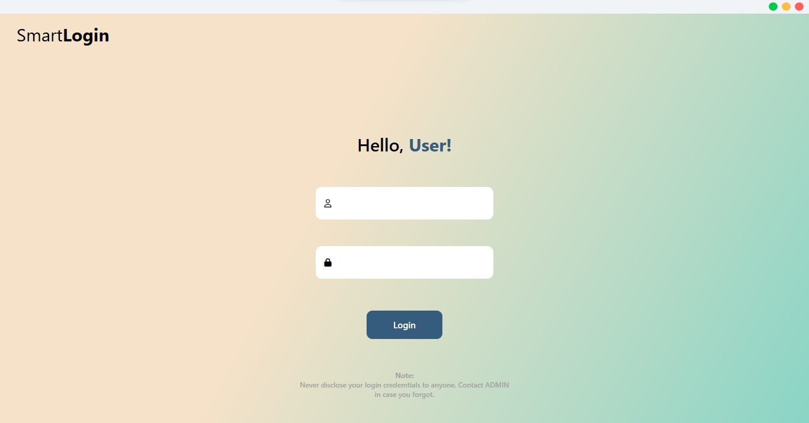
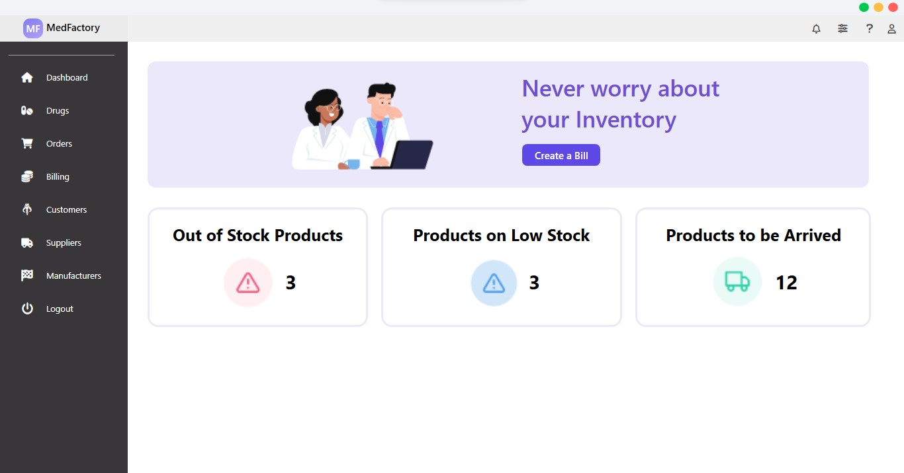

  

<h1 align="center">
  MedFactory - Pharmacy Management System
</h1>

  MedFActory is a desktop solution for pharmacies requiring to handle their day-to-day affiars. It is made using .NET 6/C# and Windows Presentation Foundation (WPF) for UI. Moreover, it os designed as per MVVM (Model-View-ViewModel) Pattern providing loose coupling between different modules of the application. Prism Library provided the MVVM boilerplate. 

### Loading Screen

  

### User Login

  

### Dashboard

  

